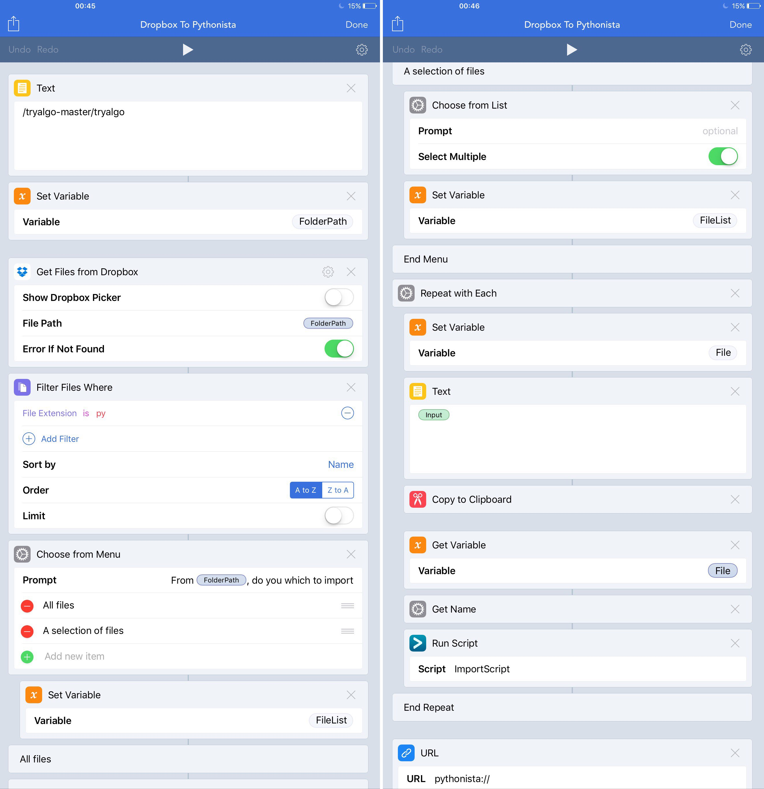

# Utilities developed on Pythonista

Some utilities developed in Pythonista which I use almost everyday. Some of the implementations uses chained URL schemes linking for instance Pythonista and Workflow. 

## Importing a full folder of python scripts into Pythonista

This development stemmed from the necessity to import 128 python scripts at once from Github back into pythonista...  

Apple has deliberately denied Pythonista the ability to use OpenIn share extension scheme (which sounds really weird as importing scripts has been recently allowed in Continuous C#/F# IDE app). I was left with only one solution...importing manually through a long serie of hazardous (Ipad) selection of text, copy and paste in new pythonista scripts. Fortunately, Ipad app workflow is flexible enough to connect apps all together and to give access to OpenIn function as well as strong integration with dropbox. 

This script automates this workflow thanks to the following steps:

1. download from github a clone of the repository as a zip file. 
2. The cloned repository is unzipped and saved on dropbox using for instance Document5 ipad free app
3. The WorkFlow lets the user choose the correct folder in the saved archive and propose the user to download all scripts or only a selection of files. Workflow filters python files only
4. For each file in the selected folder, Workflow stores the file content on the Ipad clipboard then calls a Pythonista script with the filename as an argument.
5. Pythonista script creates a new script file using the file name passed as argument and copy content of the file from the clipboard. It then stores the file in a dedicated Pythonista Directory after checking for duplicates in order to avoid overwriting.
6. Workflow is called back again using URL schemes to continue the loop over the file list (see workflow details in picture from left to right)

	

The workflow can be found [**here**](https://workflow.is/workflows/1259436e694e40ef9cb55dd6f3c98d0d)
